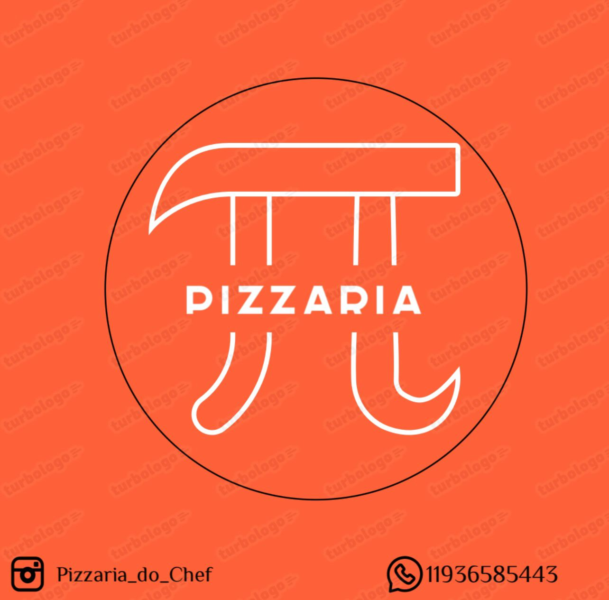

<div align="center">
  <h1>Pizzaria TT — Seu Pedido Online em Minutos!</h1>
  
</div>


---
Excelente, Eduardo!
Abaixo está o **README completo, unificado e revisado**, com tudo o que você enviou e o que criamos juntos — incluindo a **nova seção de Tecnologias Utilizadas** e o **Fluxograma de Tecnologias e Integrações (PlantUML)**.

Você pode **copiar e colar diretamente no GitHub** — já está todo formatado em Markdown e pronto para uso.

---

# Pizzaria TT (Pizzaria Pi)

A **Pizzaria Pi**, referida como **Pizzaria TT** no Front-end, é uma empresa de pequeno porte fundada em março de 2024.
Este projeto representa um sistema **Full Stack completo**, desenvolvido para aprimorar a experiência do cliente com um **cardápio interativo**, **sistema de rastreio de pedidos** e **comunicação otimizada**.

---

## 2. Visão Geral e Objetivos do Projeto

O principal objetivo do projeto é demonstrar habilidades na montagem de um **sistema Full Stack**, com foco na **satisfação do cliente** e na **eficiência operacional**.

### Objetivos Específicos

* **Logística:** Implementar um sistema de rastreio de pedidos via **Glympse**.
* **Comunicação:** Utilizar um **Chatbot (WhatsApp)** para agilizar pedidos e atendimento.
* **Dados:** Estruturar um **Back-end em Java** com persistência de dados em **MySQL**.
* **Vendas:** Otimizar as vendas e a comunicação via **WhatsApp**, com integração a **marketplaces** (iFood e Uber Eats).

---

## 3. Destaques do Desenvolvimento (Front-end e Dados)

O Front-end foi desenvolvido com foco em **eficiência**, **organização do código** e **clareza nas interações**, implementando funcionalidades essenciais de um e-commerce moderno.

### Funcionalidades Principais

* **Modelo de Pizza Flexível:**
  Cada pizza possui **preços dinâmicos** baseados no tamanho selecionado (P, M ou G), definidos por uma estrutura de dados em JavaScript.

* **Estrutura de Dados:**
  Cada item do cardápio é representado por um **objeto** contendo:
  `id`, `nome`, `tamanhos`, `precos` (array de floats) e `descricao`.

* **Cálculo Dinâmico:**
  O sistema atualiza o **valor total do carrinho em tempo real** a cada alteração do pedido, utilizando **JavaScript puro**.

* **Design Responsivo:**
  Desenvolvido com **Tailwind CSS**, garantindo uma interface moderna e adaptável a qualquer dispositivo.

---

## 4. Arquitetura e Estrutura (Full Stack)

O sistema segue uma arquitetura em **três camadas**, com **Back-end em Java**, **Front-end em HTML/CSS/JS** e **banco de dados MySQL**.

### 4.1 Estrutura do Back-end e Banco de Dados

* **Servidor:** Apache Tomcat 9
* **Linguagem:** Java
* **Conexão:** JDBC
* **Banco de Dados:** MySQL

A persistência de dados abrange informações de clientes, pedidos e observações, garantindo integridade e rastreabilidade.

#### Tabela Principal – Clientes

| Campo               | Descrição                         | Restrição                         |
| ------------------- | --------------------------------- | --------------------------------- |
| codigo              | Identificador único do cliente    | Chave Primária, Auto incrementada |
| pedidoNumero        | Número do pedido associado        | NOT NULL                          |
| nome, cpf, telefone | Dados de identificação            | NOT NULL                          |
| endereco, pagamento | Detalhes logísticos e financeiros | NOT NULL                          |
| obs                 | Observações adicionais            | Opcional                          |

---

### 4.2 Estrutura de Pastas (Front-end)

```
/
├── assets/             # Imagens, logo e ícones
├── styles/             # Arquivos CSS e configurações do Tailwind
├── index.html          # Página principal da aplicação
├── script.js           # Lógica de pedidos e cálculos dinâmicos
├── tailwind.config.js  # Configuração do Tailwind CSS
└── package.json        # Dependências e scripts do projeto
```

---

### 4.3 Tecnologias Utilizadas

O projeto **Pizzaria TT (Pizzaria Pi)** foi desenvolvido com foco em **integração Full Stack**, combinando tecnologias modernas de Front-end e Back-end para garantir desempenho, segurança e escalabilidade.

#### **Front-end**

* **HTML5:** Estrutura semântica das páginas e componentes visuais.
* **CSS3 / Tailwind CSS:** Estilização responsiva e moderna, garantindo compatibilidade com diferentes dispositivos.
* **JavaScript (ES6+):** Lógica de interação, cálculos dinâmicos e manipulação do DOM.
* **Node.js (NPM):** Gerenciamento de dependências e execução do servidor de desenvolvimento local.
* **Vercel:** Deploy do Front-end para acesso público e integração contínua.

#### **Back-end**

* **Java (JDK 17):** Linguagem principal para o desenvolvimento da API e controle de regras de negócio.
* **Apache Tomcat 9:** Servidor de aplicação responsável pela execução das rotas e serviços em Java.
* **JDBC:** Interface de conexão entre o Java e o banco de dados relacional.
* **MySQL:** Banco de dados utilizado para armazenar informações de pedidos, clientes e observações.

#### **APIs e Integrações Externas**

* **Chatbot WhatsApp (Business API):** Automação do atendimento e recebimento de pedidos 24h por dia.
* **Glympse API:** Sistema de rastreio de entregas com envio de link SMS em tempo real.
* **Marketplaces (iFood e Uber Eats):** Estratégia de expansão de vendas e integração comercial.

---

### Fluxograma de Tecnologias e Integrações

```
@startuml
title Arquitetura Tecnológica – Pizzaria TT (Full Stack)

actor Cliente

Cliente --> "Front-end (HTML, CSS, JS, Tailwind)" : Acessa Cardápio
"Front-end (HTML, CSS, JS, Tailwind)" --> "Servidor (Apache Tomcat 9)" : Envia Pedido (via API)
"Servidor (Apache Tomcat 9)" --> "Back-end Java (JDBC)" : Processa Requisição
"Back-end Java (JDBC)" --> "Banco de Dados MySQL" : Armazena e Consulta Dados

' Integrações externas
"Back-end Java (JDBC)" --> "API WhatsApp Business" : Envia Confirmação de Pedido
"Back-end Java (JDBC)" --> "API Glympse" : Envia Link de Rastreamento SMS
"Back-end Java (JDBC)" --> "Marketplaces (iFood / Uber Eats)" : Sincroniza Pedidos

' Retorno de informação
"Banco de Dados MySQL" --> "Back-end Java (JDBC)" : Retorna Dados
"Back-end Java (JDBC)" --> "Servidor (Apache Tomcat 9)" : Resposta Processada
"Servidor (Apache Tomcat 9)" --> "Front-end (HTML, CSS, JS, Tailwind)" : Atualiza Status do Pedido
"Front-end (HTML, CSS, JS, Tailwind)" --> Cliente : Exibe Status e Rastreamento

@enduml
```

---

## 5. Fluxo de Pedidos e Logística

O fluxo de pedidos demonstra como o Front-end interage com as ferramentas externas para a finalização e rastreio do pedido.

### Fluxograma do Pedido (Processo de Checkout)

```
@startuml
start
:Usuário navega pelo Cardápio;
:Seleciona Pizza e Tamanho (P/M/G);
:Adiciona ao Carrinho (Cálculo Dinâmico);

repeat
  :Continua Comprando?;
repeat while Usuário adiciona mais itens?
-> Sim;

:Clica em "Finalizar Pedido";
:Coleta Informações do Cliente (Nome/Endereço);
:Geração do Número de Pedido;
:Direcionamento para WhatsApp Business (Chatbot);
:Chatbot faz a Confirmação e Logística;

if (Pagamento Confirmado) then (Sim)
  :Ativa Rastreio Glympse (SMS);
  :Entrega do Pedido;
else (Não)
  :Pedido Cancelado;
endif

:Dados registrados no Back-end (MySQL);
stop
@enduml
```

---

## 6. Segurança e Responsabilidade

O sistema segue princípios da **Tríade CIA (Confidencialidade, Integridade e Disponibilidade)** e boas práticas ambientais e sociais.

### Segurança Digital

* **Confidencialidade:** Dados criptografados e acesso restrito.
* **Integridade:** Backups frequentes e verificação de consistência.
* **Disponibilidade:** Plano de Recuperação de Desastres (RD) e links redundantes.

### Responsabilidade Social e Ambiental

* **Gestão Ambiental:** Economia de energia, redução de papel e descarte correto de resíduos.
* **Direitos Humanos:** Valorização da diversidade, combate à discriminação e ambiente de trabalho inclusivo.

---

## 7. Ver Projeto Online (Deploy)

O Front-end está disponível para acesso público:

**Acesse o projeto:**
[Vercel - Pizzaria TT](https://pizzaria-tt.vercel.app)

---

## 8. Como Executar Localmente

Siga os passos abaixo para rodar o projeto Front-end em seu ambiente local:

```bash
# Clone o repositório
git clone https://github.com/Eduardodanield/Pizzaria.git

# Acesse a pasta
cd Pizzaria

# Instale as dependências
npm install

# Execute o servidor de desenvolvimento
npm run dev
```

Acesse no navegador a URL gerada (exemplo: `http://localhost:xxxx`).

---

## 9. Autores e Contrato Social

**GitHub:** [Eduardo Daniel Alves Sampaio](https://github.com/Eduardodanield)

**LinkedIn:** [Eduardo Daniel Alves Sampaio](https://linkedin.com/in/eduardo-daniel-alves-sampaio-a52133106)

**Código Back-end:** [Drive Folder](https://drive.google.com/drive/folders/1d0EBybIvSTlSztjZZ5CBWigbGOxcSTVC?usp=drive_link)


### Contrato Social – Pizzaria Pi Ltda

* **Sócios Fundadores:**
  Eduardo Daniel Alves Sampaio, Diogo Neves Oliveira e Gustavo Fernandes dos Santos.

* **Tipo de Sociedade:**
  Sociedade Limitada (Ltda).

* **Objeto Social:**
  Prestação de serviços culinários, com foco em eficiência, rapidez e qualidade no atendimento.

